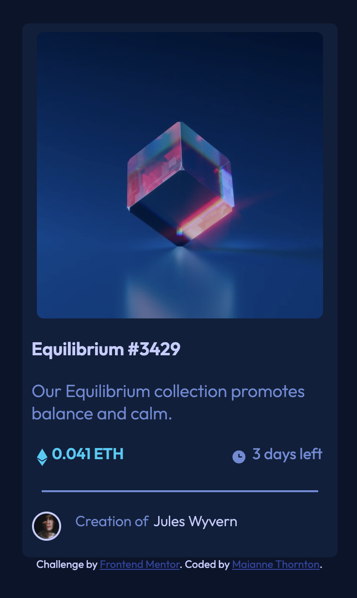

# Frontend Mentor - NFT preview card component solution

This is a solution to the [NFT preview card component challenge on Frontend Mentor](https://www.frontendmentor.io/challenges/nft-preview-card-component-SbdUL_w0U). Frontend Mentor challenges help you improve your coding skills by building realistic projects. 

## Table of contents 😌

- [Overview](#overview)
  - [The challenge](#the-challenge)
  - [Screenshot](#screenshot)
  - [Links](#links)
- [My process](#my-process)
  - [Built with](#built-with)
  - [What I learned](#what-i-learned)
  - [Continued development](#continued-development)
  - [Useful resources](#useful-resources)
- [Author](#author)
- [Acknowledgments](#acknowledgments)

## Overview 👋🏾
Welcome to my first Frontend Mentor Challenge!

### The challenge 😥

Users should be able to:

- View the optimal layout depending on their device's screen size
- See hover states for interactive elements

### Screenshot 🌇

### Links 👩🏾‍💻

- Solution URL: (https://github.com/MaianneThornton/FM-nft-preview-card-component)
- Live Site URL: (https://nft-preview-card-solution.netlify.app/)

## My process 💭
I started by consulting the style guide, and created a separate stylesheet. Then I marked out initial classes and id's in the html file to be later used for styling. I also added images and icons during this step. Next I began styling the css to begin building the card's visuals. I then added the media queries, to give the breakpoints for desktop and mobile devices. Lastly, I added the active styles so that the card is responsive.

### Built with 👷🏾‍♀️

- Semantic HTML5 markup
- CSS custom properties
- Flexbox
- Mobile-first workflow

### What I learned 👩🏾‍🏫

I learned how to Image Overlay and Icon, which was very exciting. It took some trial and error, but I finally came up with something that I am very proud of.

I also learned a better way to write git commit messages. It really streamlines, the comments and allows for readers to get a better idea as to what changes were made.
### Continued development 🔮

In the future I plan on continuing to practice positioning elements as well as learning more effects like the active styles I used during this exercise.

I also plan on continuing to learn the best ways to phrase git commits, so that future viewers can fully understand the changes that have occured.

### Useful resources 📖

- [Resource 1](https://www.w3schools.com/howto/howto_css_image_overlay_icon.asp) - This helped me determine the best course of action in implementing the image overlay icon feature.
- [Resource 2](https://www.freecodecamp.org/news/how-to-write-better-git-commit-messages/) - This is an amazing article which helped me write better commit messages. I'd recommend it to anyone still learning this concept.
- [Resource 3](https://9elements.com/bem-cheat-sheet/) - This is an amazing article which helped me write class names and better organize my code. I'd recommend it to everyone learning this concept.

## Author 🔎

- Website - [Maianne Thornton](https://www.maiannethornton.com/)
- Frontend Mentor - [@MaianneThornton](https://www.frontendmentor.io/profile/MaianneThornton)
- GitHub - [@MaianneThornton](GitHub.com/MaianneThornton)
- Twitter - [@MaianneThornton](https://twitter.com/MaianneThornton)
- LinkedIn - [@MaianneThornton](https://www.linkedin.com/in/maiannethornton/)

## Acknowledgments 🙏🏾
Special Thanks go to [@PhoenixDev22](https://www.frontendmentor.io/profile/PhoenixDev22) and [@zeerobit](https://www.frontendmentor.io/profile/zeerobit) for their expertise and assistance in fine-tuning my code.